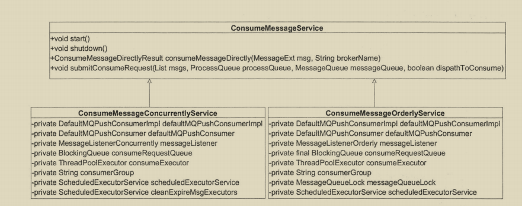

## 消息消费概述

消费组的消费模式
- 集群模式: 主题下的同一条消息只允许被其中一个消费者消费
- 广播模式: 主题下的同一条消息将被集群内的所有消费者消费一次


消息消费逻辑


消息消费顺序图  


## 消费者启动流程

`org.apache.rocketmq.client.impl.consumer.DefaultMQPushConsumerImpl#start
`

`org.apache.rocketmq.client.impl.consumer.DefaultMQPushConsumerImpl.copySubscription`
```java
 private void copySubscription() throws MQClientException {
        try {
            Map<String, String> sub = this.defaultMQPushConsumer.getSubscription();
            if (sub != null) {
                for (final Map.Entry<String, String> entry : sub.entrySet()) {
                    final String topic = entry.getKey();
                    final String subString = entry.getValue();
                    SubscriptionData subscriptionData = FilterAPI.buildSubscriptionData(this.defaultMQPushConsumer.getConsumerGroup(),
                        topic, subString);
                    this.rebalanceImpl.getSubscriptionInner().put(topic, subscriptionData);
                }
            }

            if (null == this.messageListenerInner) {
                this.messageListenerInner = this.defaultMQPushConsumer.getMessageListener();
            }

            switch (this.defaultMQPushConsumer.getMessageModel()) {
                case BROADCASTING:
                    break;
                case CLUSTERING:
                    final String retryTopic = MixAll.getRetryTopic(this.defaultMQPushConsumer.getConsumerGroup());
                    // 构建主题定于信息SubscriptionData并加入到RebalanceImpl订阅消息中
                    SubscriptionData subscriptionData = FilterAPI.buildSubscriptionData(this.defaultMQPushConsumer.getConsumerGroup(),
                        retryTopic, SubscriptionData.SUB_ALL);
                    this.rebalanceImpl.getSubscriptionInner().put(retryTopic, subscriptionData);
                    break;
                default:
                    break;
            }
        } catch (Exception e) {
            throw new MQClientException("subscription exception", e);
        }
    }
```
第一步:
同构构建主题订阅信息SubscriptionData并加入到RebalanceImpl的订阅消息中订阅关系来源主要:
- 通过调用`org.apache.rocketmq.client.consumer.DefaultMQPushConsumer#subscribe(String
  topic, String subExpression)`
- 订阅重试消息, 消费者在启动的时候会自动订阅该主题, 参与该主题的消息队列负载

第二步: 初始化MQClientInstance, RebalanceImple等

第三步: 初始化消息进度. 如果消息消费是集群模式,
那么消息进度保存在Broker上;如果是广播模式, 那么消息消费进度存储在消费端

第四步: 根据是否是顺序消费, 创建消费端消费线程服务.
ConsumeMessageService主要负责消息消费, 内部维护一个线程池

第五步: 向MQClientInstance注册消费者, 并启动MQClientInstance,
在一个JVM中的所有消费者, 生产者持有一个MQClientInstance,
MQClientInstance只会启动一次


## 消息拉取

在集群模式下, 同一个消费组内有多个消息消费者, 同一个主题存在多个消费队列,
那么消费者如何进行消息队列负载呢, 从上下文的启动流程,
得知每一个消费组内维护一个线程池来消费消息

消息队列负载, 一个消息队列在同一时间内置允许被一个消息消费者消费,
一个消息消费者可以同时消费多个消息队列, RocketMQ是如何实现?

RocketMQ使用一个单独的线程PullMessageService来负责消息的拉取

`org.apache.rocketmq.client.impl.consumer.PullMessageService#run`

```java
public void run() {
        log.info(this.getServiceName() + " service started");
        // stopped声明为volatile, 每执行一次检查一下stopped的状态, 当其他线程将stopped设置为true, 则停止该方法的执行
        while (!this.isStopped()) {
            try {
                // 从pullRequestQueue队列中获取一个PullRequest消息拉取任务, 如果pullRequestQueue为空, 则线程将阻塞, 直到有拉取任务被放入
                PullRequest pullRequest = this.pullRequestQueue.take();
                this.pullMessage(pullRequest);
            } catch (InterruptedException ignored) {
            } catch (Exception e) {
                log.error("Pull Message Service Run Method exception", e);
            }
        }

        log.info(this.getServiceName() + " service end");
    }
```

`PullRequest`在何时添加

`org.apache.rocketmq.client.impl.consumer.PullMessageService#executePullRequestImmediately`

方法的调用主要在两个地方
- RocketMQ根据PullRequest拉取任务执行完一次消息拉取任务后,
  又将PullRequest对象放入到pullRequestQueue
- 在RebalanceImpl中创建

```java
 public void executePullRequestLater(final PullRequest pullRequest, final long timeDelay) {
        if (!isStopped()) {
            this.scheduledExecutorService.schedule(new Runnable() {
                @Override
                public void run() {
                    PullMessageService.this.executePullRequestImmediately(pullRequest);
                }
            }, timeDelay, TimeUnit.MILLISECONDS);
        } else {
            log.warn("PullMessageServiceScheduledThread has shutdown");
        }
    }

public void executePullRequestImmediately(final PullRequest pullRequest) {
        try {
            this.pullRequestQueue.put(pullRequest);
        } catch (InterruptedException e) {
            log.error("executePullRequestImmediately pullRequestQueue.put", e);
        }
    }
```

`PullRequest`

主要字段
```java
    // 消费者组
    private String consumerGroup;
    // 待拉取消费队列
    private MessageQueue messageQueue;
    // 消息处理队列, 从Broker拉取到的消息先存入ProccessQueue, 然后再提交到消费者消费线程池消费
    private ProcessQueue processQueue;
    // 待拉取的MessageQueue偏移量
    private long nextOffset;
    // 是否被锁定
    private boolean lockedFirst = false;
```

`ProcessQueue`实现机制


#### 消息拉取基本流程

消息拉取主要分为3个步骤:
- 消息拉取客户端消息拉取请求封装
- 消息服务器查找并返回消息
- 消息拉取客户端处理返回的消息

`org.apache.rocketmq.client.impl.consumer.DefaultMQPushConsumerImpl#pullMessage`消息拉取入口


#### 消息服务端Broker组装消息

`org.apache.rocketmq.broker.processor.PullMessageProcessor#processRequest`
Broker端处理消息拉取方法

#### 消息消费过程
消息拉取的过程从PullMessageService负责对消息队列进行消息拉取,
从远端服务器拉取消息后将消息存入ProcessQueue消息队列处理队列中,
然后调用ConsumeMessageService#submitConsumeRuquest方法进行消息消费,
使用线程池来消费消息, 确保了消息拉取与消息消费的解耦.  
RocketMQ支持顺序消费与并发消费




