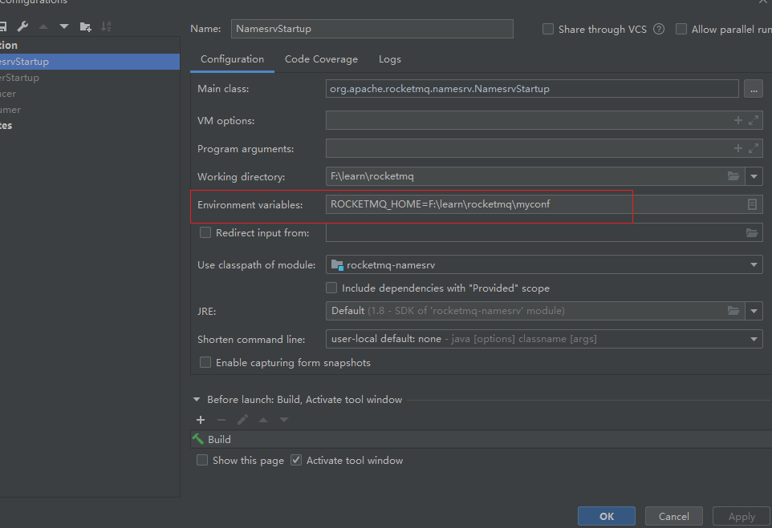
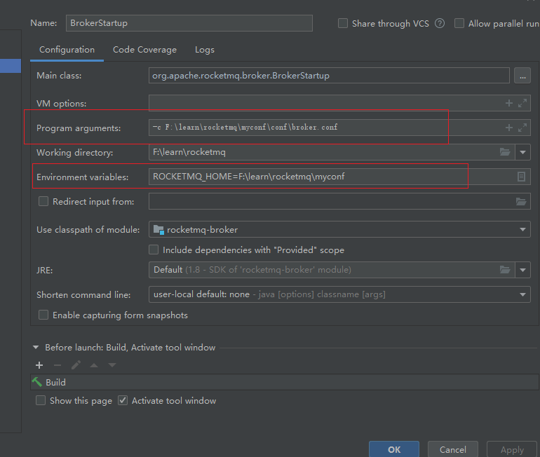
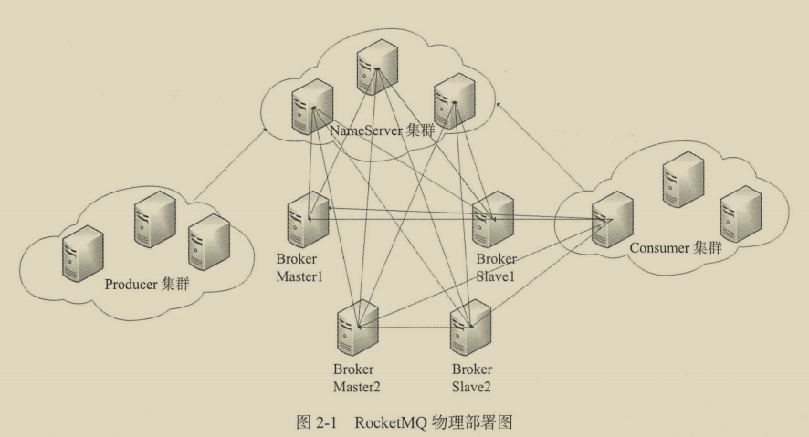

# RocketMQ学习笔记

## RocketMQ核心目录说明
- broker: broker模块(broker启动进程)
- client: 消息客户端, 包含消息生产者, 消息消费者相关类
- common: 公共包
- dev: 开发者信息
- distribution: 部署实例文件夹
- example: RocketMQ实例代码
- filter: 消息过滤相关基础类
- filtersrv: 消息过滤服务器实现相关类(Filter启动进程)
- logappender: 日志实现相关类
- namesrv: NameServer实现相关类(NameServer启动进程)
- openmessaging: 消息开放标准
- remoting: 远程通信模块, 基于netty
- srvutil: 服务器工具类
- store: 消息存储实现相关类
- style: checkstyle相关实现
- test: 测试相关类
- tools: 工具类, 监控命令相关实现类


## 源码阅读配置准备
在项目路径下新建 myconf目录 详情可看myconf目录配置  
配置`org.apache.rocketmq.namesrv.NamesrvStartup`类启动参数
```
Environment variables: ROCKETMQ_HOME=F:\learn\rocketmq\myconf
```
配置`org.apache.rocketmq.broker.BrokerStartup`类启动参数
```
Program arguments: -c F:\learn\rocketmq\myconf\conf\broker.conf
Environment variables: ROCKETMQ_HOME=F:\learn\rocketmq\myconf
```
配置完成后启动 这两个类






## RocketMQ路由中心NameServer
### NameServer架构设计, 启动流程
#### 1. NameServer架构设计


Broker 消息服务器在启动时向所有 Name Server 注册，消息生产者（Producer）在发送消
息之前先从 Name Server 获取 Broker 服务器地址列表，然后根据负载算法从列表中选择一
台消息服务器进行消息发送. NameSErver与每台Broker服务器保持长链接,
并间隔30s检测Broker是否存活, 如果检测到Broker宕机, 则从路由注册表中将其移除,
但是路由变化不会马上通知消息生产者, 这是为了降低NameServer实现的复杂性,
在消息发送段提供容错机制来保证消息发送的高可用性.

#### 2. NameServer启动流程
- 第一步: 解析配置文件
- 第二步: 根据启动属性创建NamesrvController实例, 并初始化该实例,
  NameServerController实例为NameServer核心控制器
- 第三步: 注册JVM钩子函数并启动服务器, 以便监听Broker, 消息生产者的网络请求

```java
 public static NamesrvController main0(String[] args) {

        try {
            // NameServer启动三个步骤

            // 1. 创建NamesrvController, 在创建之前, 会先读取系统配置, NamesrvController为NameServer核心控制器
            NamesrvController controller = createNamesrvController(args);
            // 2. 启动NameServer, 在启动的同时注册jvm钩子, 启动服务器, 监听Broker, 消息生产者的网络请求
            start(controller);
            String tip = "The Name Server boot success. serializeType=" + RemotingCommand.getSerializeTypeConfigInThisServer();
            log.info(tip);
            System.out.printf("%s%n", tip);
            return controller;
        } catch (Throwable e) {
            e.printStackTrace();
            System.exit(-1);
        }

        return null;
    }
```
### NameServer路由注册,故障剔除
NameServer主要作用是为消息生产者和消息消费者提供关于主题Topic的路由信息,
所以NameServer需要存储路由的基础信息, 还要能够管理Broker节点, 包括路由注册,
路由删除等功能.


